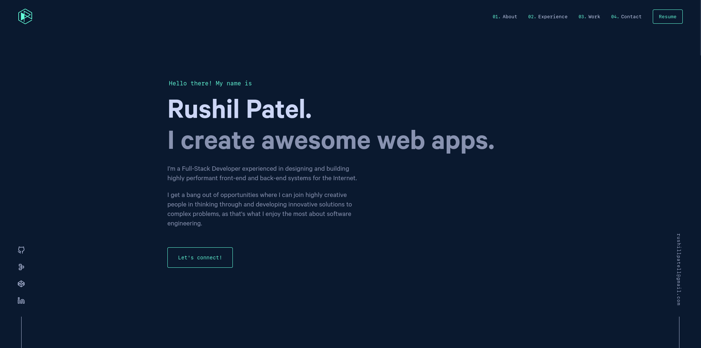

<div align="center">
  
</div>
<h1 align="center">
  My Portfolio
</h1>

<div align="center">
  
</div>

<p>
  This is the first iteration of my <a href="https://rushilp1.github.io">portfolio</a> website, built with <a href="https://www.gatsbyjs.org">Gatsby</a>, and hosted with <a href="https://www.gatsbyjs.org">GitHub Pages</a>.
</p>

## 🛠 Installation & Set Up

1. Install the Gatsby CLI

   ```sh
   npm install -g gatsby-cli
   ```

2. Install and use the correct version of Node using [NVM](https://github.com/nvm-sh/nvm)

   ```sh
   nvm install
   ```

> [!NOTE]
> Use Node v16 to ensure that everything works (and builds) smoothly!

3. Install dependencies

   ```sh
   yarn
   ```

4. Start the development server

   ```sh
   npm start
   ```

## 🚀 Building and Running for Production

1. Generate a full static production build

   ```sh
   npm run build
   ```

2. Preview the site as it will appear once deployed

   ```sh
   npm run serve
   ```

3. Deploy the site to GitHub

   ```sh
   npm run deploy
   ```

---

This repo was originally cloned from [Brittany Chiang](https://brittanychiang.com)'s portfolio repo. To know more about the forking and accreditation rules, check out her [repo](https://github.com/bchiang7/v4).